# Flow dan Logika Aplikasi KasKu — Manajemen Uang Kas Mahasiswa

Dokumen ini menjelaskan alur kerja (workflow) pengguna, alur data, serta logika otomatisasi sistem aplikasi **KasKu** sesuai dengan implementasi yang berjalan (`app.py`, `models.py`, `routes.py`). Seluruh modul dideskripsikan menggunakan Mermaid Diagram dan penjelasan logika bisnis.

---

## 1. Flow Utama & Autentikasi Pengguna
### A. Alur Pengunjung Umum (Public Guest Flow)
Pengunjung umum dapat mengakses landing page, Informasi Kas (termasuk mengirim pesan ke bendahara), serta Tentang & FAQ tanpa perlu login.

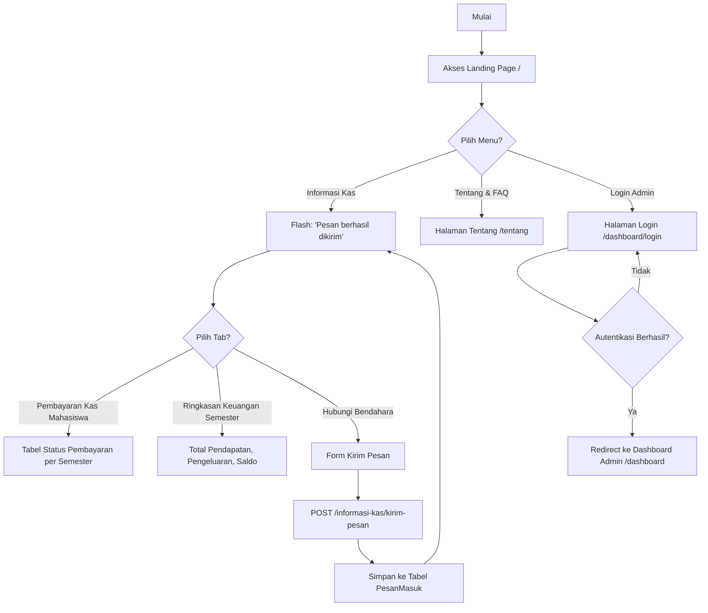

### B. Alur Autentikasi & Session Administrator (Admin Session Flow)
Mengamankan seluruh route dashboard di bawah path `/dashboard/*` (kecuali `/dashboard/login`) menggunakan decorator `login_required`.

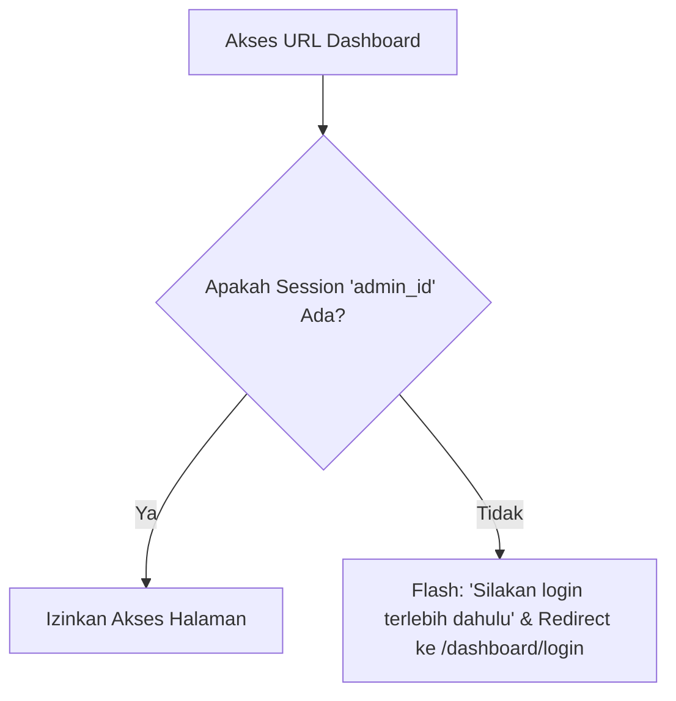

---

## 2. Alur Kerja Modul Aplikasi (Workflow per Modul)

### 1. Flow Dashboard Admin
Dashboard admin memuat ringkasan eksekutif keuangan kas mahasiswa beserta grafik Chart.js. Seluruh komponen diperbarui ketika admin memilih semester pada filter dropdown.

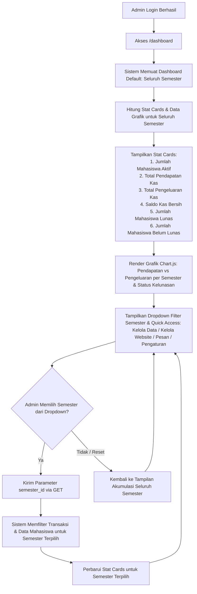

### 2. Flow CRUD Mahasiswa
Modul manajemen mahasiswa mencakup pendaftaran data, pembaruan, penghapusan, pencarian, dan navigasi ke detail pembayaran.

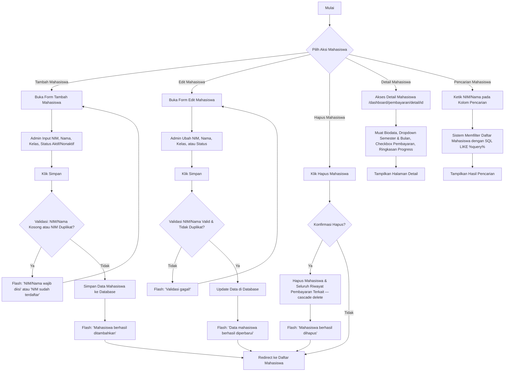

### 3. Flow CRUD Semester
Modul untuk mengelola data semester secara dinamis, termasuk pengaturan daftar bulan pembayaran, nominal per bulan/minggu, dan jumlah minggu per bulan.

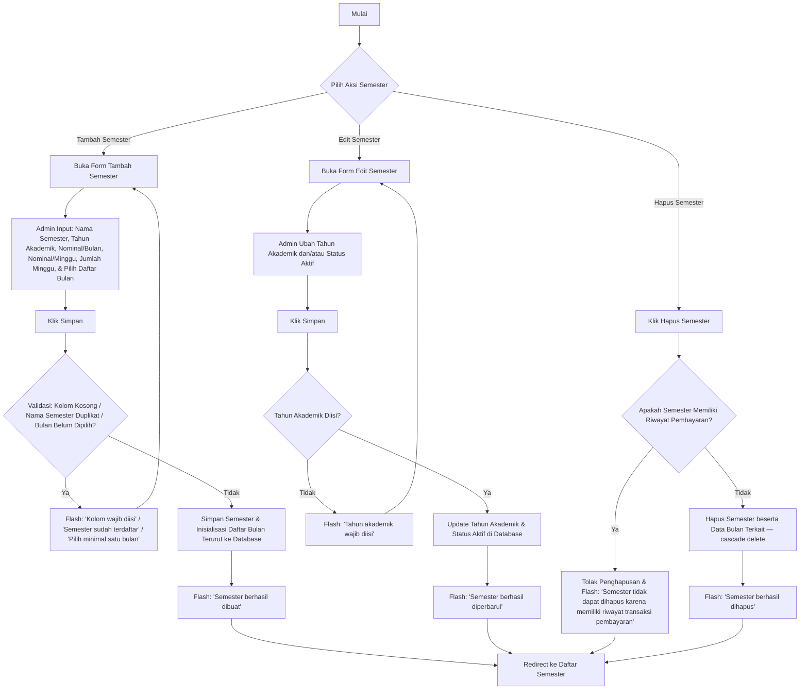

### 4. Flow Pembayaran Kas Mahasiswa & Rekap Pembayaran
Pembayaran uang kas dilakukan lewat Detail Mahasiswa: pilih semester, lalu pilih bulan, barulah sistem merender checkbox mingguan. Seluruh transaksi dapat dipantau ringkas di menu Kelola Pembayaran, dan ditelusuri detail di Rekap Pembayaran.

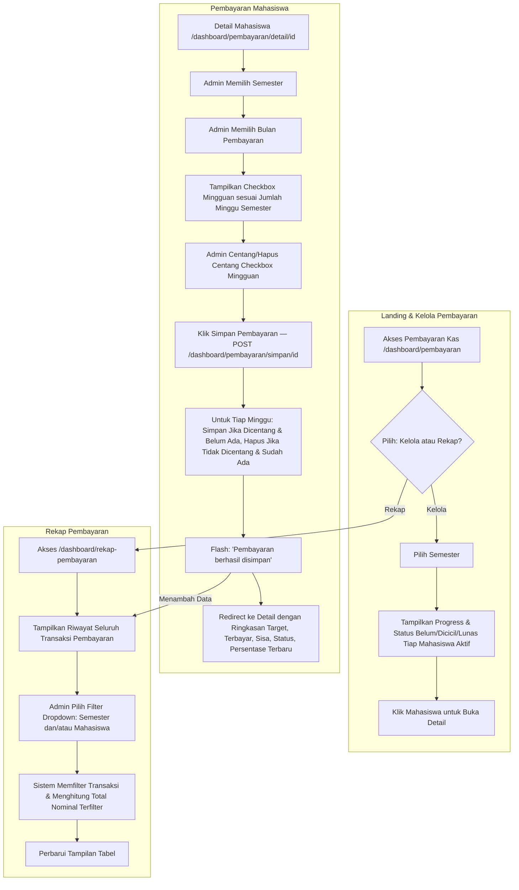

### 5. Flow Pendapatan Kas (Otomatis, Tanpa Form)
Pendapatan kas murni berasal dari agregasi transaksi Pembayaran. Tidak ada halaman atau form khusus untuk menambah, mengedit, maupun menghapus pendapatan secara manual.

> [!WARNING]
> **PENTING**: Tidak ada route atau tombol CRUD untuk modul Pendapatan. Nilainya selalu dihitung otomatis (`SUM(Pembayaran.nominal)`) dan ditampilkan di Dashboard, Informasi Kas (tab Ringkasan Keuangan Semester), dan Rekap Pembayaran — demi menjaga integritas data keuangan.

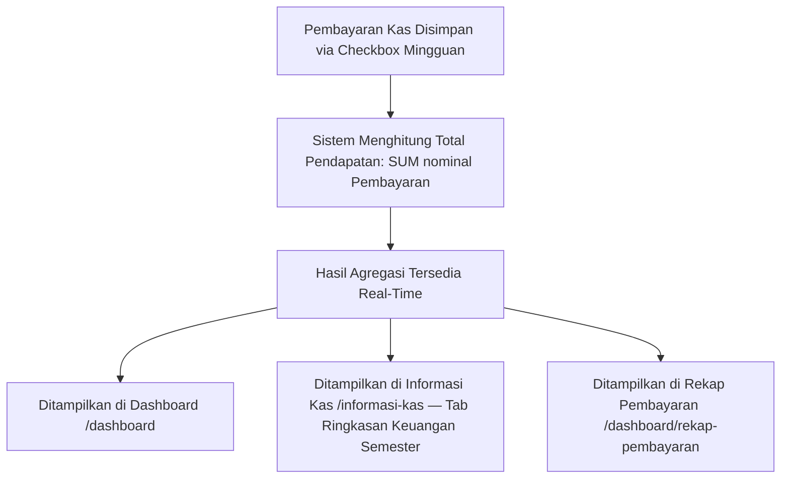

### 6. Flow Pengeluaran Kas (Landing, Riwayat, & CRUD dengan Validasi Saldo)
Pencatatan pengeluaran kas dilakukan admin dengan validasi saldo yang mencegah nominal pengeluaran melebihi saldo kas bersih (Total Pendapatan − Total Pengeluaran), baik untuk penambahan maupun pembaruan data.

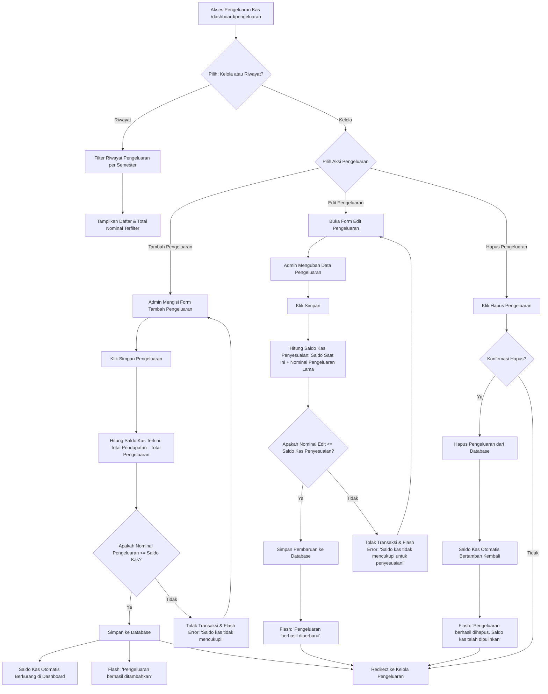

### 7. Flow Kelola Website (Beranda & Tentang/FAQ)
Admin mengelola konten dinamis yang ditampilkan di halaman publik (Landing Page dan Tentang & FAQ) tanpa perlu mengubah kode.

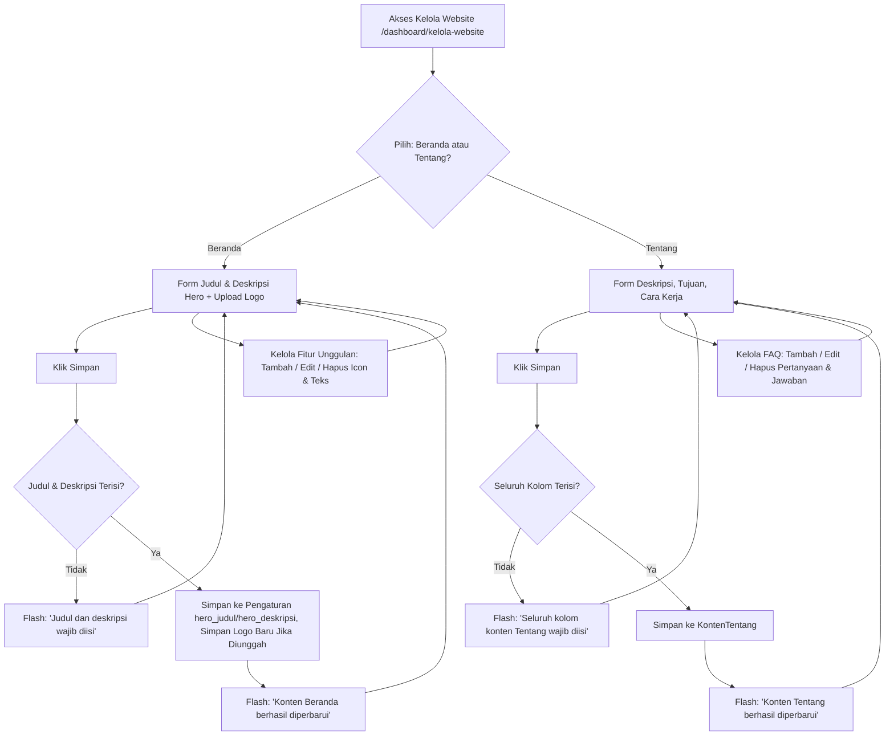

### 8. Flow Pesan Masuk (Hubungi Bendahara)
Menampilkan dan mengelola pesan yang dikirim pengunjung lewat tab "Hubungi Bendahara" di halaman Informasi Kas.

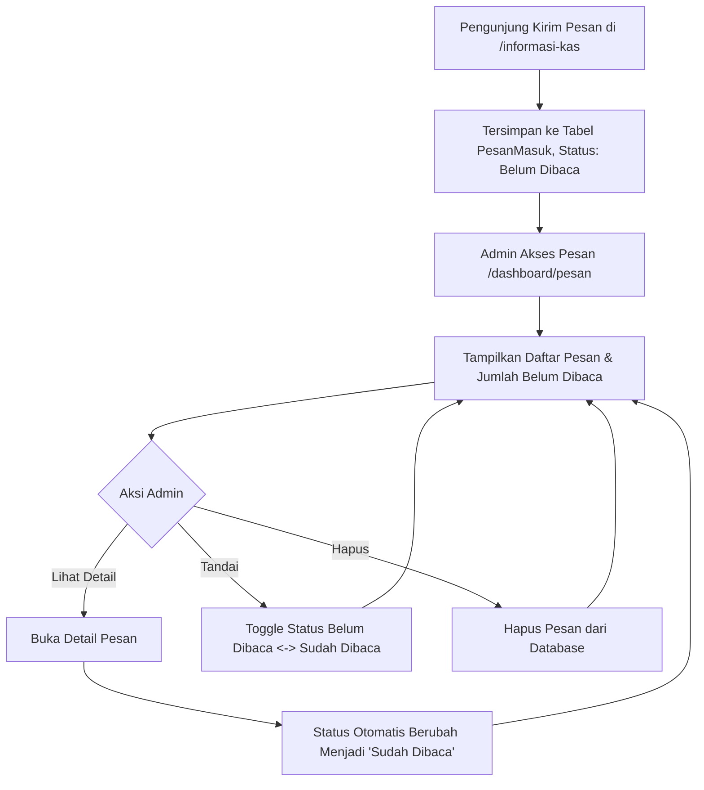

### 9. Flow Pengaturan Sistem (Dinamis & Historis)
Admin dapat mengatur parameter kas default serta kredensial akunnya sendiri dalam satu halaman dengan dua formulir terpisah.

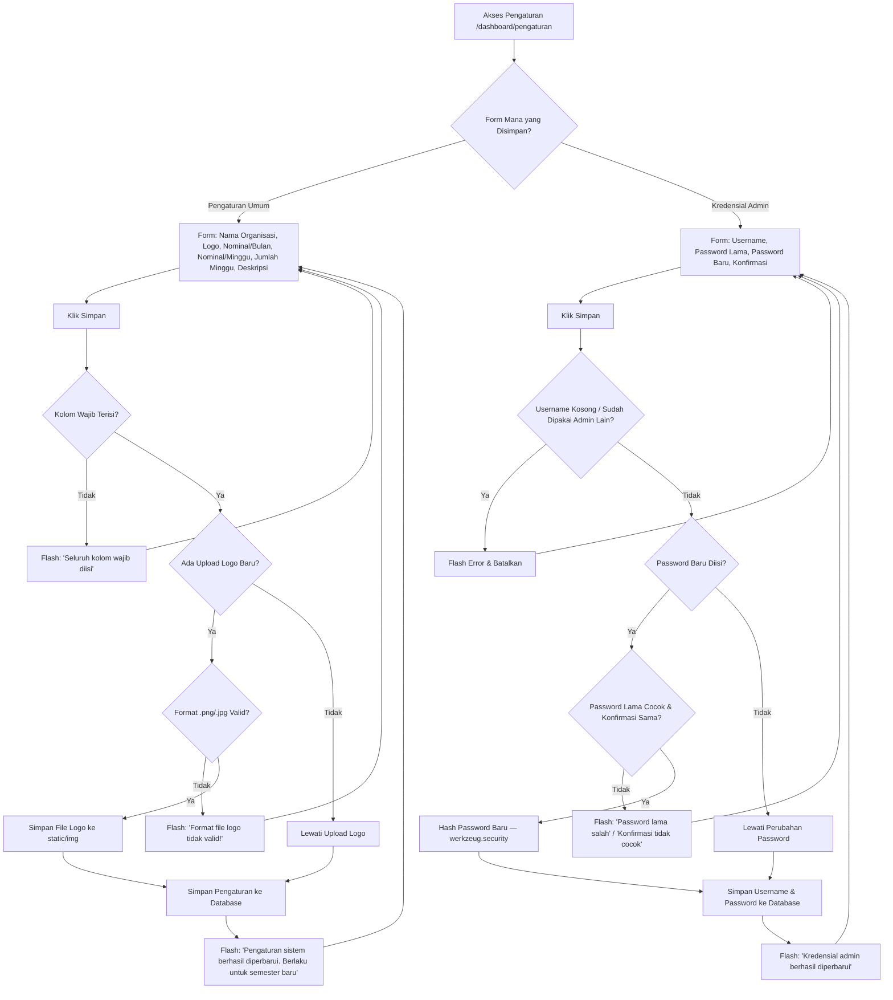

### 10. Flow Logout
Mengakhiri sesi admin secara aman dan membersihkan seluruh state otentikasi.

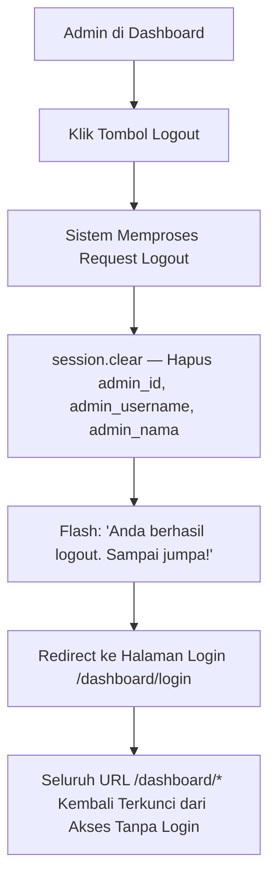

---

## 3. Flow Keseluruhan Sistem (Main System Architecture)

Diagram berikut menjelaskan hubungan antarmuka, proses CRUD, perhitungan dinamis saldo, hingga sistem konten yang melingkupi seluruh modul aplikasi:

```mermaid
graph TD
    %% Public
    LP[Landing Page /] -->|Akses| IK[Informasi Kas /informasi-kas]
    LP -->|Akses| TT[Tentang & FAQ /tentang]
    LP -->|Akses Login| LG[Login Admin /dashboard/login]
    IK -->|Kirim Pesan| PSM[(Tabel PesanMasuk)]

    LG -->|Autentikasi Berhasil| DB[Dashboard Admin /dashboard]

    %% Dashboard Quick Access
    DB -->|Navigasi| KD[Kelola Data]
    DB -->|Navigasi| KW[Kelola Website]
    DB -->|Navigasi| PSN[Pesan]
    DB -->|Navigasi| SET[Pengaturan]
    DB -->|Keluar| LGO[Logout]

    %% Kelola Data
    KD -->|Kartu| MHS[Manajemen Mahasiswa CRUD]
    KD -->|Kartu| SEM[Manajemen Semester CRUD]
    KD -->|Kartu| PMB[Pembayaran Kas: Kelola & Rekap]
    KD -->|Kartu| PGL[Pengeluaran Kas: Kelola & Riwayat]

    %% Kelola Website
    KW -->|Kartu| BRD[Beranda: Hero & Fitur Unggulan]
    KW -->|Kartu| TTG[Tentang: Deskripsi & FAQ]
    BRD -->|Update Konten| LP
    TTG -->|Update Konten| TT

    %% Relationships & Automations
    MHS -->|Lihat Detail| DTL[Detail Mahasiswa]
    DTL -->|Pilih Semester & Bulan| SEM
    SEM -->|Memiliki Relasi| BUL[Daftar Bulan Pembayaran]
    BUL -->|Centang Checkbox Mingguan| TRX[(Tabel Pembayaran)]

    TRX -->|Otomatis Hitung Pendapatan| SAL[(Saldo Kas = Pendapatan - Pengeluaran)]
    PGL -->|Simpan Pengeluaran, Validasi Saldo| SAL
    SAL -->|Ditampilkan| DB
    SAL -->|Ditampilkan| IK

    TRX -->|Sumber Data| PMB
    PSM -->|Sumber Data| PSN

    SET -->|Setelan Default Berlaku untuk| SEM
    SET -->|Ubah Kredensial| LG

    LGO -->|Hapus Session & Redirect| LG
```
